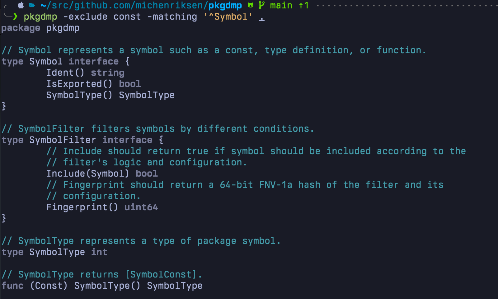

# pkgdmp - Go code analysis tool

<div align="center">
  
</div>
<br />
<br />

`pkgdmp` is a simple command-line tool for analyzing directories containing Go code. It provides an overview of functions, structs, methods, function types, and interfaces defined in the packages within those directories.

> **Note**
> Please be aware that this project is a work in progress, and it may contain bugs or unexpected behavior. Additionally, both the CLI and the package API can get breaking changes while the version is below 1.0.0

**Features:**

- Customizable output options
- Entity filtering using patterns
- Multiple syntax highlighting themes
- JSON output generation

**Todo:**

- [x] Implement parsing and printing of `const`.
- [ ] Implement parsing and printing of `var`.

## Usage

```console
user@example:~$ pkgdmp -help

pkgdmp v0.2.0

USAGE:

  pkgdmp [FLAGS] DIRECTORY [DIRECTORY2] ...

FLAGS:

  -exclude string
        comma-separated list of symbol types to exclude [$PKGDMP_EXCLUDE]
  -exclude-matching string
        exclude symbols with names matching regular expression [$PKGDMP_EXCLUDE_MATCHING]
  -exclude-packages string
        comma-separated list of package names to exclude [$PKGDMP_EXCLUDE_PACKAGES]
  -full-docs
        include full doc comments instead of synopsis [$PKGDMP_FULL_DOCS]
  -json
        output as JSON [$PKGDMP_JSON]
  -matching string
        only include symbol with names matching regular expression [$PKGDMP_MATCHING]
  -no-docs
        exclude doc comments [$PKGDMP_NO_DOCS]
  -no-env
        skip loading of configuration from 'PKGDMP_*' environment variables
  -only string
        comma-separated list of symbol types to include [$PKGDMP_ONLY]
  -only-packages string
        comma-separated list of package names to include [$PKGDMP_ONLY_PACKAGES]
  -theme string
        syntax highlighting theme to use - see https://xyproto.github.io/splash/docs/ [$PKGDMP_THEME] (default "swapoff")
  -unexported
        include unexported entities [$PKGDMP_UNEXPORTED]
  -version
        print version information and exit

SYMBOL TYPES:

  arrayType, chanType, const, func, funcType, identType, interface, mapType, struct

```

## Examples

Analyze the contents of the `myproject` directory and display all exported entities:

```console
user@example:~$ pkgdmp myproject
package mypackage

// An ugly const declaration group to check that parser handles different
// scenarios correctly.
const (
        MyStringConst, MyUint32Const, MyIntConst         = "hello", uint32(123), 42
        MyFloatConst                                     = 1.234
        MyFloat32Const                           float32 = 4.321
)

const MyInitConst int

// MySingleConst checks that parser handles a single const declaration
// correctly.
const MySingleConst = "example"

// Check that parser handles this common const declaration method correctly.
const (
        MyFatal MyLogLevel = iota
        MyError
        MyWarn
        MyInfo
        MyDebug
)
. . .
```

Analyze the `myproject` directory, excluding entities matching pattern and displaying full documentation comments in JSON format:

```console
user@example:~$ pkgdmp -exclude-matching "^My.*Function$" -full-docs -json myproject
[
  {
    "name": "mypackage",
    "consts": [
      {
        "doc": "An ugly const declaration group to check that parser handles different\nscenarios correctly.",
        "consts": [
          {
            "names": [
              "MyStringConst",
              "MyUint32Const",
              "MyIntConst"
            ],
            "values": [
              {
                "value": "\"hello\"",
                "type": "string"
              },
              {
                "value": "123",
                "type": "uint32",
                "specific": true
              },
              {
                "value": "42",
                "type": "int"
              }
            ]
          },
          {
            "names": [
              "MyFloatConst"
. . .
```

## Installation

Grab a pre-compiled version from the [release page](https://github.com/michenriksen/pkgdmp/releases) or install the latest version with Go:

```console
user@example:~$ go install github.com/michenriksen/pkgdmp@latest
```
